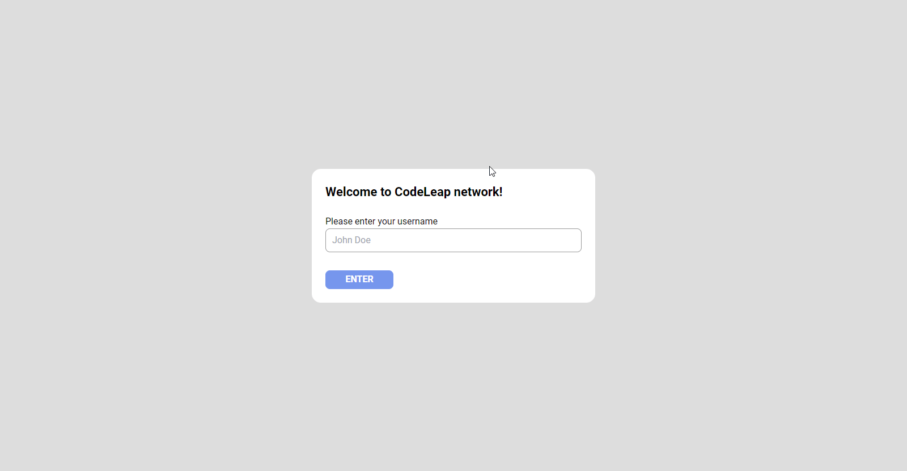

# Codeleap test 👍.

This is a page I created for the selective process at Codeleap.

## Tools 🛠️

-  🔨 TypeScript - for make a code more scalable.
-  🔨 Redux - for management state.
-  🔨 TailwindCss - for stylizing.
-  🔨 React Router - for pages routing.
-  🔨 React Hook Form - for easily create great forms.
-  🔨 Eslint and Prettier - for standardization.

## Preview

## See deploy.

## Running.

-  Run `yarn` or `npm i` in the folder that containing the `package.json` file to restore the packages.

-  Run `yarn dev` or `npm dev` and then go to the browser at [http://localhost:5173/](http://localhost:5173/) to view the page.

### Credits

-  CodeLeap Figma.
